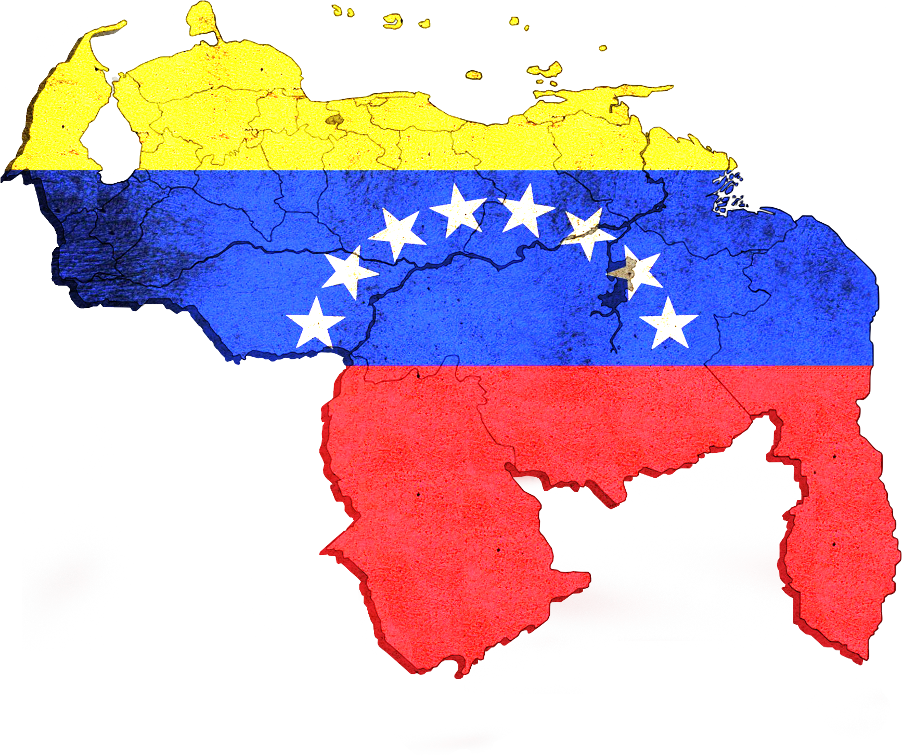

# Venezuela

Distribución Geográfica de Venezuela



Este repositorio contiene un conjunto de archivos con la lista de los **Estados**, **Municipio** y **Parroquias** de **Venezuela** asi como una gran cantidad de **Comunidades**.

## Esquema del Directorio `src`

```text
└── 📁src
    └── 📁with_communities
        └── venezuela_mysql.sql
        └── venezuela_sqlite.sql
        └── venezuela.json
        └── venezuela.php
        └── venezuela.sqlite3
    └── 📁without_communities
        └── venezuela_mysql.sql
        └── venezuela_sqlite.sql
        └── venezuela.json
        └── venezuela.php
        └── venezuela.sqlite3
```

> Debido al gran peso que generan las comunidades se ha decidido crear 2 carpetas una Sin Comunidades Incluidas (`without_communities`) y otras full (`with_communities`)

### Información de archivos

Los Archivos Mysql y Sqlite contiene los datos necesarios para crear la base de datos (sus tablas y relaciones) a fin que solo importarla a su proyecto es suficiente.

Los archivos JSON siguen el siguiente esquema:

```json
{
  "cod_iso": {
    "name": "Nombre del Estado",
    "capital": "Capital del Estado",
    "municipalities": [
      {
        "name": "Nombre del Municipio",
        // Con comunidades
        "parishes": [
            {
                "name": "Nombre de la Parroquia",
                "communities": ["comunidad1", "comunidad2"]
            }
        ],
        // Sin Comunidades
        "parishes": ["Nombre de Parroquia", "Nombre de parroquia"]
      }
    ]
  }
}
```

Donde `cod_iso` es el **código ISO** del estado algo como `VE-A`.

> El único cambio importante aquí es que con comunidades (`with_communities`) Parroquias(`parishes`) seria una Matriz con varios Objectos dentro pero sin comunidades solo seria un array de nombres.

Los Archivos PHP son una version del JSON, básicamente es un PHP que retorna una matriz con los datos.

Adicional a esto Se añadió una DB SQLITE lista para trabajar y recibir consultas.

### Creditos

Toda la información aquí añadida fue obtenidas de fuentes como:

1. [Wikipedia](https://es.wikipedia.org/wiki/Anexo:Entidades_federales_de_Venezuela),
2. [Sistema Estadístico Geográfico (APN)](https://apisegen.apn.gob.ve/) (La Gran Mayoría de la Información fue obtenida de aquí)
3. [Instituto Nacional de Estadísticas (INE)](https://ine.gob.ve/)

Asi como otras fuentes de internet tratando de lograr lo mas actualizado posible.

### Notas Adicionales

La comunidades no están a su 100% le recomiendo antes de usar esta opción revisar las comunidades listadas.

## Documentación

Puede Visitar la Web oficial para este este repositorio y asi obtener información en vivió.
